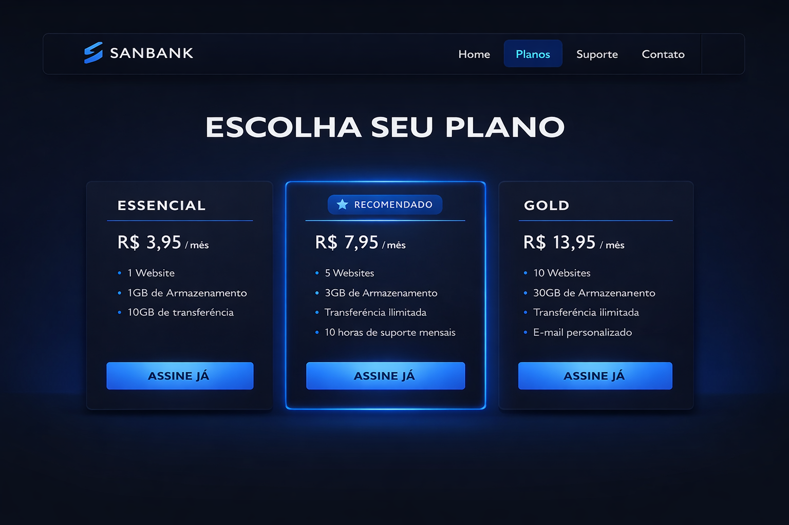

# Menu

- [Cores](#2-cores-color-tokens)
- [Tipografia](#3-tipografia)
- [Espaçamento](#4-espaçamento-spacing-system)
- [Grid Layout](#5-grid--layout)
- [Border Radius](#6-radius-cantos)
- [Elevação e Sombra](#7-elevação-e-sombras-depth)
- [Estados de interação](#8-estados-interaction-states)
- [Componentes](#9-componentes-specs)
  - [Botão](#91-button)
  - [Planos](#92-pricing-card-plan-card)
  - [Badge](#93-badge)
  - [Inputs](#94-inputs)
  - [Tabela](#95-table-comparação)
- [Iconografia](#10-iconografia)
- [Animação](#11-motion-animação)
- [Acessibilidade](#12-acessibilidade-mínimo)
   

# SANBANK — Design System (Handoff) v1.0

## 1. Princípios de marca

Personalidade: moderna, tecnológica e confiável.
Tom: direto, limpo, sem excesso de “neon”.
Estética: dark mode premium + detalhes em azul (fintech).
Sensação: “produto de dev” (preciso e bem acabado).

## 2. Cores (Color Tokens)

[Menu](#menu)

- **Core**
  - Background / Base: #0F172A
  - Primary: #2563EB
  - Accent: #38BDF8
  - Text / On Dark: #F8FAFC
- **Neutros de apoio (derivados)**
  - Use neutros como variações do background para superfícies:
    - Surface 1 (cards): um tom acima do fundo (ex.: azul/acinzentado bem escuro)
    - Surface 2 (hover/pressed): ligeiramente mais claro que Surface 1
    - Border: branco com baixa opacidade (ex.: 10–16%)
    - Regra de consistência: todo “cinza” do produto é um azul-acinzentado. Evitar cinza puro.
- **Gradiente da marca**
  - Primary Gradient: #2563EB → #38BDF8 (45°)
  - Uso permitido:
    - botões primários
    - pequenos detalhes (borda do plano Premium, ícone/mark)
    - destaques no hero
  - Evitar:
    - gradiente em textos longos
    - gradiente como fundo geral de cards (use só glow/realce)

## 3. Tipografia

[Menu](#menu)

- **Fonte**
  - Inter (principal do produto)
- **Escala tipográfica (Desktop)**
  - Display: 48px / 56px — weight 800
  - H1: 40px / 48px — weight 800
  - H2: 28px / 36px — weight 700
  - H3: 20px / 28px — weight 700
  - Body: 16px / 26px — weight 400
  - Small: 14px / 22px — weight 400
  - Caption: 12px / 18px — weight 500
- **Regras**
  - Headings com tracking levemente negativo (ex.: -1% a -2%) para ficar “tech”.
  - Textos longos sempre em Body 16/26.
  - Números de preço podem ser maiores (ex.: 44–52px) e bem bold.

## 4. Espaçamento (Spacing System)

[Menu](#menu)

Baseado em grid de 8px.

- **Tokens:**
  - 4, 8, 12, 16, 24, 32, 48, 64

- **Regras:**
  - Cards sempre com padding mínimo 24px.
  - Distância entre seções: 48–64px.
  - Gap padrão de grids: 24px.

## 5. Grid & Layout

[Menu](#menu)

- **Container**
  - Max width: 1120px
  - Padding lateral: 16px (mobile) / 24px (desktop)

- **Pricing Page**
  - Grid de 3 cards (desktop)
  - 1 coluna (mobile)
  - Cards com alturas equilibradas (CTA alinhado)

## 6. Radius (Cantos)

[Menu](#menu)

- Small: 10px (inputs, badges)
- Medium: 14px (botões)
- Large: 18px (cards menores)
- XL: 26px (hero card / grandes containers)

_Regra: use radius grande para dar “produto premium”._

## 7. Elevação e sombras (Depth)

[Menu](#menu)

O SANBANK usa sombras suaves e profundas (dark UI).

- **Níveis**
  - Elevation 1 (Card): sombra discreta + borda suave
  - Elevation 2 (Hover): sombra mais forte + leve “lift”
  - Glow (Premium): halo azul suave (primary/accent) + borda destacada

- **Regras:**
  - Não usar sombras duras.
  - Glow sempre sutil, nunca neon.

## 8. Estados (Interaction States)

[Menu](#menu)

- **Botões**
  - Default: normal
  - Hover: levantar 1–2px + sombra aumenta
  - Pressed: volta para 0px + sombra reduz
  - Disabled: opacidade 50–60% e sem sombra

- **Inputs**
  - Default: borda leve
  - Focus: borda com accent + ring suave (glow)
  - Error: usar vermelho (apenas para validação, sem exagero)
  - Success: usar verde com moderação (feedback pontual)

## 9. Componentes (Specs)

[Menu](#menu)

### 9.1 Button

- **Tamanhos**
  - SM: 40px height
  - MD: 44px height (padrão)
  - LG: 50px height

- **Variações**
  - Primary: gradiente da marca, texto branco
  - Secondary: superfície escura + borda
  - Ghost: transparente + borda leve
  - Danger: vermelho apenas quando necessário
  - Padding horizontal padrão: 16–18px
  - Font: 14–15px, weight 700

### 9.2 Pricing Card (Plan Card)

- **Estrutura**
  - Nome do plano (caps pequeno)
  - Preço grande + “/mês”
  - Lista de benefícios
  - CTA (botão)
  - Dimensões
  - Padding: 24–32px
  - Borda: 1px
  - Radius: 18–26px

- **Plano recomendado (Premium)**
  - borda em primary (um pouco mais forte)
  - glow suave em azul
  - badge “Mais popular”

### 9.3 Badge

- Height visual: ~28–32px
- Radius: 999px
- Fundo: accent/primary com baixa opacidade
- Texto: 12px bold

### 9.4 Inputs

- Height: 44px
- Radius: 10–14px
- Placeholder com opacidade baixa
- Focus ring em accent

### 9.5 Table (Comparação)

- Head com fundo um pouco mais claro que o card
- Linhas com separadores leves
- Ícones de check consistentes (outline)

## 10. Iconografia

[Menu](#menu)

- Estilo: outline, minimalista, stroke uniforme.
- Peso: stroke 2 (aprox).
- Tamanho padrão: 20–24px em UI, 16px em tabelas.
- _Evitar ícones “filled” misturados com outline._

## 11. Motion (Animação)

[Menu](#menu)

- **Duração**
  - Hover/press: 160–220ms
  - Entrada (seções): 240–320ms

- **Curva**
  - Ease-out suave (produto moderno)

_Regra: animação sempre discreta (fintech)._

## 12. Acessibilidade (mínimo)

[Menu](#menu)

- Contraste alto (texto #F8FAFC sobre bg #0F172A é ótimo)
- Focus visível (ring em accent)
- Clique mínimo: 44px de altura em botões/inputs
- Estados claros (disabled, error)
